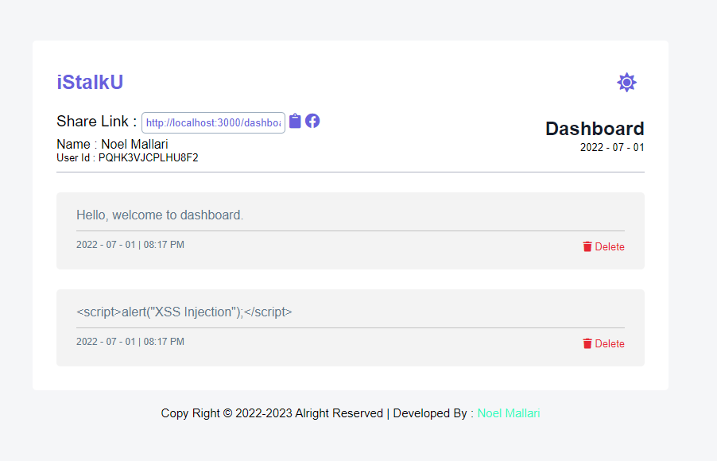
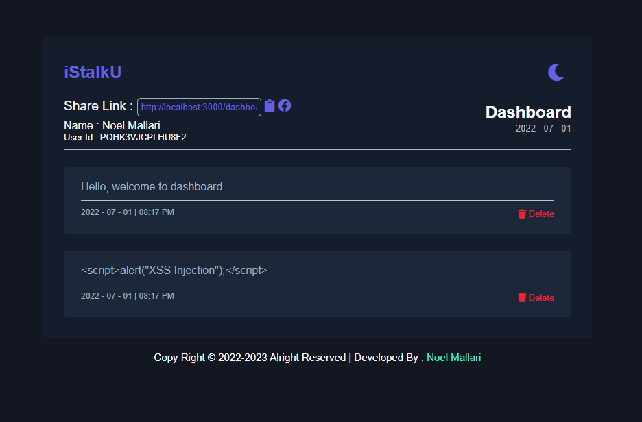

<h1 align="center">Code Igniter v4 - iStalkU</h1>

Code Igniter v4 - iStalkU where you can get message from your friends, co-workers, etc.

# Preview

  
  

# Requirements
- 🧠 Brain
- 🕸 Xampp, Wampp or Any web server that supports mysql.
- 📝Code Editor (`Vscode`, `Sublime Text`) 

# How to use?
- Step 1 : Download [`Xampp`](https://www.apachefriends.org/) or [`Wampp`](https://www.wampserver.com/en/).
- Step 2 : Clone this repo or download the file manually.
- Step 3 : Open your code editor then locate the file/folder path 📁.
- Step 4 : If the Step 3 was done, Open your terminal and type the `php spark serve` 😉.
- Step 5 : If you don't know how to do it, Just have a sleep ✌.
- Step 6 : Don't forget to click the `star ⭐` from my repo.

If you have any question about my repo you can contact me through my [facebook account](https://web.facebook.com/noel.mallari.5648137).

<h1 align="center">💌 Thank You! 💖</h1>

